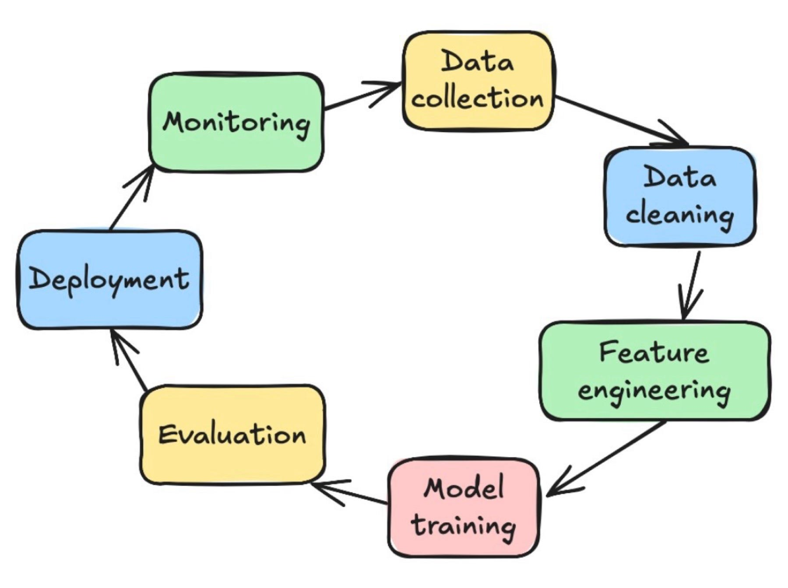

# Data Science Steps for ML

In any ML project, after you define the business use case and establish the success criteria, the process of delivering an ML model to production involves the following steps. These steps can be completed manually or can be completed by an automatic pipeline.

