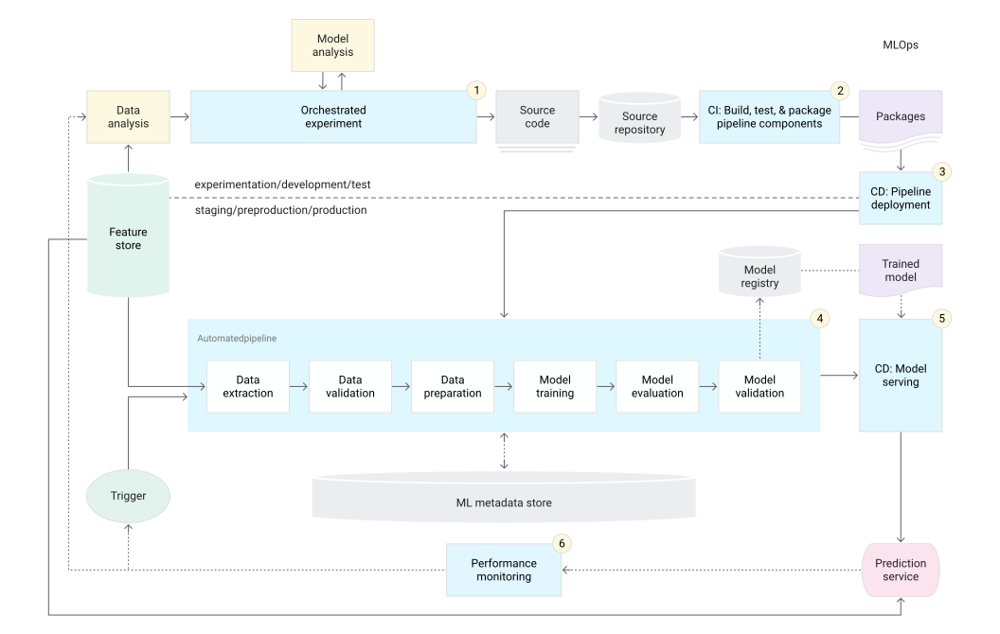

# MLOps Core

This document discusses techniques for implementing and automating continuous integration, continuous delivery, and continuous training for machine learning systems.

In other words, we want to apply DevOps principles to ML systems (MLOps). Practicing MLOps means that you advocate for automation and monitoring at all steps of ML system construction, including integration, testing, releasing, deployment and infrastructure management.

Only a small fraction of a real-world ML system is composed of the ML code.

To develop and operate complex systems like these, you can apply DevOps principles to ML systems. This document covers concepts to consider when setting up an MLOps environment for your data science practices, such as CI, CD, and CT in ML.

### DevOps versus MLOps
***What is the difference between traditional CI/CD and CI/CD for ML?***

DevOps is a popular practice in developing and operating large-scale software systems. This practice provides benefits such as shortening and development cycles, increasing deployment velocity, and dependable releases. To achieve these benefits, you introduce two concepts in the software system development:

- Continuous integration (CI)
- Continuous delivery (CD)

As ML system is a software system, so similar practices apply to help guarantee that you can reliably build and operate ML systems at scale.

ML and other software systems are similar in continuous integration of source control, unit testing, integration testing, and continuous delivery of the software module or the package. However, in ML, there are a few notable differences:
- CI is no longer only about testing and validating code and components, but also testing and validating data, data schemas, and models.
- CD is no longer about a single software package or a service, but a system (an ML training pipeline) that should automatically deploy another service (model prediction service).
- CT is a new property, unique to ML systems, that's concerned with automatically retraining and serving the models.

### Data Science Steps for ML

In any ML project, after you define the business use case and establish the success criteria, the process of delivering an ML model to production involves many steps, for example: data extraction, analysis, preparation, model training, model evaluation, validation, serving, and model monitoring.

The level of automation of these steps ***defines the maturity of the ML process, which reflects the velocity of training new models given new data or training new models given new implementations***.

### MLOps level 0: Manual process

In this level, the process for building and deploying ML models is entirely manual. This is considered the basic level of maturity, or level 0.

**Characteristics**

MLOps level 0 is a manual, script-driven process where each step, including data analysis, preparation, model training, and validation, is performed interactively by data scientists. There is a clear separation between data scientists, who create models, and engineers, who deploy them as prediction services, leading to potential training-serving skew. Model iterations are infrequent, with new versions deployed only a few times a year. Continuous integration (CI) and continuous deployment (CD) are not implemented, as model changes are rare.

The process focuses solely on deploying the model for prediction, without active performance monitoring or tracking of model behavior, which may result in undetected performance degradation. Deployment often includes A/B testing or online experiments before full deployment.

**Challenges**

Level 0 is common in businesses just starting with ML, relies on a manual, data-scientist-drive process. While sufficient for infrequent model updates, it faces challenges in real-world deployments, where models often fail due to environmental or data changes. To maintain accuracy, active monitoring of model performance, frequent retraining with up-to-date date, and continuous experimentation with new implementations are essential. Implementing CI/CD and continuous training (CT) practices can streamline this process, enabling quicker updates and improvements to the model pipeline.

### MLOps level 1: ML pipeline automation

The goal of level 1 is to perform continuous training of the model by automating the ML pipeline, this lets you achieve continuous delivery of model prediction service. To automate the process of using new data to retrain models in production, you need to introduce automated data and model validation steps to the pipeline, as well as pipeline triggers and metadata management.

This level introduces automation and orchestration for rapid experimentation, enabling quick iteration and smoother transitions to production. It features continuous training (CT) of models in production using fresh data triggered by live pipeline events. The setup ensures eperimental and operational symmetry, using the same pipeline in both development and production environments. Code modularization allows reusable and containerized components, ensuring reproducibility and isolation across environments. Continuous delivery automates the deployment of new models, ensuring that the prediction service remains up-to-date with the latest trained models. Unlike level 0, level 1 deploys the entire training pipeline, which recurrently updates the model.

To enable continuous training (CT) in ML pipelines, addtional components are required:
1. **Data and Model validation:** Before training, the data must be validated for schema and value skews to ensure proper model retraining. After training, the model is validated against evaluation metrics and compared to the previous model to ensure better performance before deployment. This also includes compatibility testing for the deployment environment.
2. **Feature Store:** A centralized repository that stores and serves features for training and prediction. It ensures consistency between training and serving data, minimizes training-serving skew, and allows for efficient feature retrieval during experimentation and continuous training.
3. **Metadata Management:** Records execution details of the ML pipeline, including versioning, execution times, parameters, and intermediate outputs. This helps in debugging, ensuring reproducibility, and managing data lineage for future comparisons or rollbacks.
4. **ML Pipeline Triggers:** Automate retraining based on triggers such as new data availability, performance degradation, or changes in data distribution (concept drift). These triggers ensure timely updates to the model based on fresh data and changes in the environment.

When managing a few ML pipelines, manual testing and deployment of new implementations may be sufficient. This setup works well for deploying new models based on fresh data rather than new ML ideias. However, to rapidly test and deploy new ML components or manage multiple pipelines in production, a CI/CD setup is necessary to automate the build, test, and deployment processes.

### MLOps level 2: CI/CD pipeline automation

The level 2 introduces CI/CD pipelines automation for efficient and reliable updates in production. This system allows data scientists to quickly experiment with new ideias, such as feature engineering and model architecture, by automating the build, test, and deployment of new pipeline components to the target environment. The setup integrates both automated ML pipelines and CI/CD routines for seamless operation.

This MLOps setup includes the following components:
- Source control
- Test and build services
- Deployment services
- Model registry
- Feature store
- ML metadata store
- ML pipeline orchestrator

**Characteristics**

The CI/CD automated ML pipeline consists of several stages:
1. **Development and Experimentation:** DS experiment with new algorithms and models, producing the source code to be pushed to a repository.
2. **Pipeline Continuous Integration:** The source code is built and tested, producing pipeline components (packages, executables, and artifacts) for deployment.
3. **Pipeline Continuous Develivery:** Artifacts are deployed to the target environment, resulting in a new model implementation.
4. **Automated Triggering:** The pipeline is automatically executed based on a schedule or trigger, leading to a trained model being pushed to the model registry.
5. **Model Continuous Develiry:** The trained model is deployed as a prediction service.
6. **Monitoring:** Model performance is monitored, triggering the next pipeline execution or experiment cycle if needed.

Data and model analysis remain manual steps in this process.

**Continuous Integration**

Continuous integration (CI) involves building, testing, and packaging pipeline components whenever new code is committed to the repository. The CI process includes several tests, such as:
- Unit testing for feature engineering and model methods.
- Testing model training covergence to ensure the loss decreases and avoids overfitting.
- Verifying that model training doesn't produce NaN values from invalid operations.
- Ensuring each pipeline component produces the expected artifacts.
- Testing the integration between different pipeline components.

**Continuous Delivery**

Continuous develiry ensures that new pipeline implementations and models are consistently delivered to the target environment for prediction services. Key considerations include:
- Verifying model compatibility with the target infrastructure, including necessary resources.
- Testing the prediction service API to ensure correct responses and performance under load.
- Validating data for retraining or batch prediction.
- Ensuring models meet performance targets before deployment.
- Automating deployment to a test environment and semi-automating deployment to pre-production after review.
Performing manual deployment to production after successful pre-production runs.

### Conclusion

Implementing ML in production involves deploying an automated ML pipeline, not just an API for predictions. A CI/CD systens enables automatic testing and deployment of new models, allowing the pipeline to adapt to changes in data and business environments. You can gradually adopt these practices to enhance the automation of your ML system development and production.

### References

- [MLOps: Continuous delivery and automation pipelines in machine learning](https://cloud.google.com/architecture/mlops-continuous-delivery-and-automation-pipelines-in-machine-learning)
