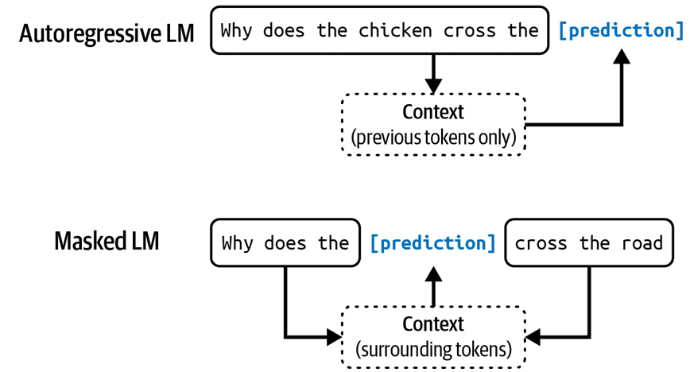

# AI Engineering

Notes about the book AI Engineering by Chip Huyen.

### From Language Model to Large Language Model

Claude Shannon used more sophisticated statistics to decipher enemies' messages during the Second World War. His work on how to model English was published in his 1951 landmark paper "Prediction and Entropy of Printed English". Many concepts introduced in this paper, including entropy, are still used for language modeling today. In the early days, a language model involved one language. However, today, a language model can involve multiple languages.

### Token

The basic unit of a language model is token, it can be a character, a word, or a part of a word (like -tion), depending on the model.

The process of breaking the original text into tokens is called tokenization. ***For GPT-4, an avarage toke is approximately 3/4 the length of a word. So, 100 tokens are approximately 75 words.***

Why do language models use token as their unit instead of word or character?
1. Compared to characters, tokens allow the model to break words into meaningful components. For example, "cooking" can be broken into "cook" and "ing", with both components carrying some meaning of the original word.
2. Because there are fewer unique tokens than unique words, this reduces the model's vocabulary size, making the model more efficient (as discussed in Chapter 2).
3. Tokens also help the model proccess unknown words. For instance, a made-up word like "chatgpting" could be split into "chatgpt" and "ing", helping the model understand its structure. Tokens balance having fewer units than words while retaining more meaning than individual characters.

There are two main types of language models: masked language models and autoregressive language models. ***They differ based on what information they can use to predict a token.***

### Masked language model

A masked language model is trained to predict missing tokens anywhere in a sequence, using the context from both before and after the missing tokens. In essence, a masked language models is trained to be able to fill in the blank. An example of a masked language model is bidirectional encoder representations from transformers or BERT.

This type of model are commonly used for non-generative tasks such as sentiment analysis, text classification, and also code debugging.

### Autoregressive language model

An autoregressive language model is trained to predict the next token in a sequence, using only the preceding tokens. It can continually generate one token after another. Today, autoregressive language models are the models of choice the text generation, and for this reason, they are much more popular than masked language models.

The outputs of language models are open-ended. ***A model that can generate open-ended outputs is called generative***, hence the term generative AI.

You can think of a  language model as a **completion machine**: given a text (prompt), it tries to complete that text. Completions are predictions, based on probabilities, and not guaranteed to be correct.